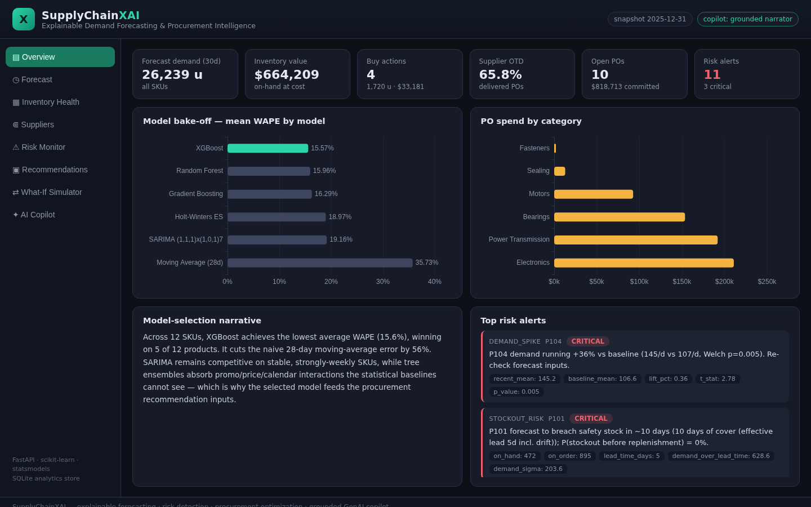
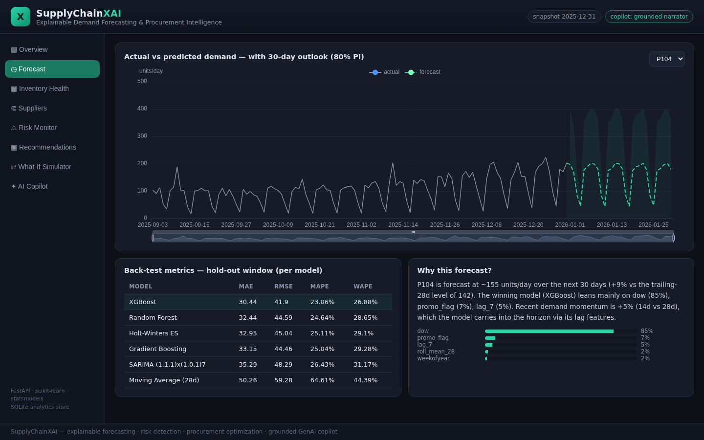
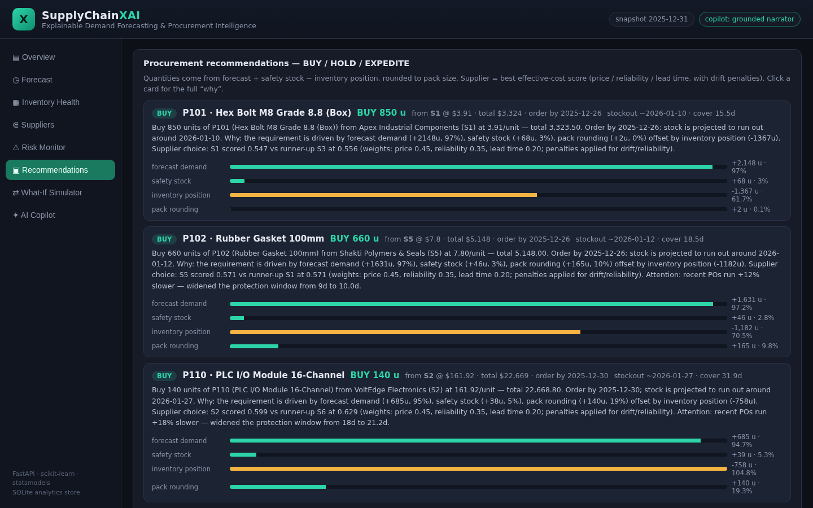
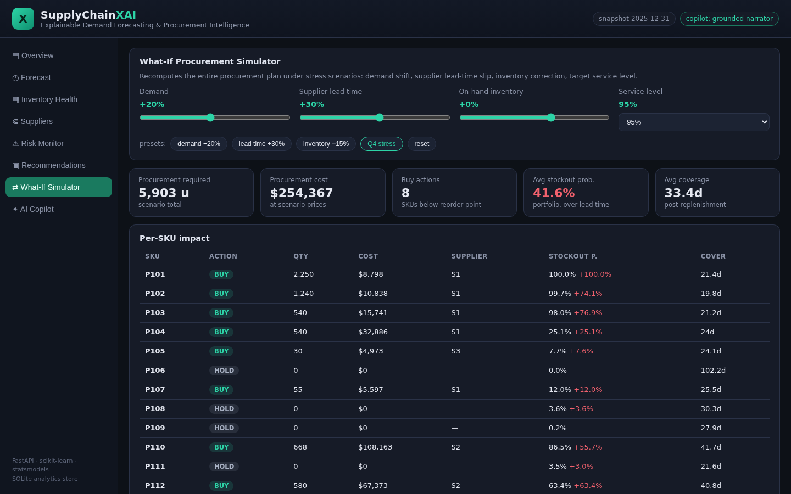
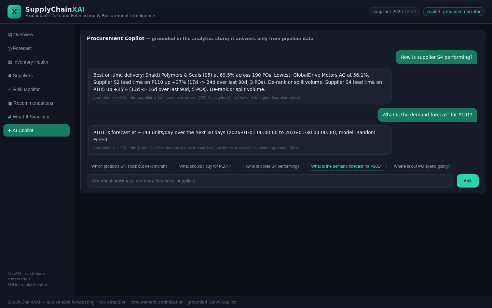
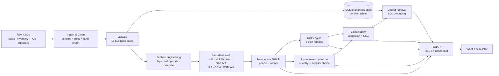

# SupplyChainXAI

**Explainable Demand Forecasting & Procurement Intelligence** — an end-to-end
decision-support system for procurement teams, built around one idea:
*every number the system produces must be able to explain itself.*

Procurement decisions are still made on historical averages and gut feel.
SupplyChainXAI replaces that with a transparent pipeline that answers the five
questions a buyer actually asks:

| Question | Component |
|---|---|
| What will demand be? | **Forecasting** — 5 model families compared per SKU (MAE / RMSE / MAPE / WAPE) |
| What could go wrong? | **Risk engine** — stockout probability, overstock, demand spikes, supplier lead-time drift, price anomalies |
| What should I buy, when, from whom? | **Recommendation engine** — order quantity + supplier selection with drift-aware scoring |
| Why is it recommended? | **Explainability layer** — additive decomposition of every BUY + natural-language rationale |
| What if things change? | **What-If Simulator** — re-plans the entire portfolio under stress scenarios |

…plus a **grounded GenAI Procurement Copilot** that answers questions strictly
from the analytics store (it refuses to invent numbers), served through a
**FastAPI backend and an executive dashboard**.



---

## What it looks like

| | |
|---|---|
|  |  |
| *Actual vs forecast with 80% PI — P104's demand spike is visible and explained* | *Every BUY decomposes into demand / safety stock / inventory / rounding* |
|  |  |
| *What-If Simulator: demand +20%, lead +30% → full re-plan with per-SKU deltas* | *Copilot answers cite the exact SQL / artifacts they came from* |

More screenshots in [`docs/screenshots/`](docs/screenshots).

---

## Architecture



Detailed component documentation: [`docs/architecture.md`](docs/architecture.md).

---

## Results (real, reproducible — see `artifacts/`)

Back-test: final **90 days** hold-out, 12 SKUs, daily granularity.

| Model | MAE | RMSE | MAPE | WAPE |
|---|---|---|---|---|
| **XGBoost** (portfolio winner) | **10.25** | **16.99** | **15.94%** | **15.57%** |
| Random Forest | 10.51 | 17.30 | 15.85% | 15.96% |
| Gradient Boosting | 10.83 | 17.19 | 17.12% | 16.29% |
| Holt-Winters ES | 12.31 | 18.36 | 25.02% | 18.97% |
| SARIMA (1,1,1)x(1,0,1)7 | 12.59 | 19.04 | 23.50% | 19.16% |
| Moving Average (28d) — baseline | 23.97 | 29.20 | 61.13% | 35.73% |

The selected model cuts naive-baseline error by **56%**. Tree ensembles win on
promo-heavy SKUs; SARIMA still takes 1 SKU (stable, strongly-weekly demand) —
which is exactly why the system compares instead of assuming.

What the risk engine found on the shipped snapshot (2025-12-31):

- **CRITICAL** — `P104` demand running **+36%** vs baseline (Welch p = 0.005): level-shift detected 21 days before it would exhaust stock
- **CRITICAL** — `P101`, `P102` below safety stock inside their replenishment lead time
- **WARNING** — supplier `S2` lead time on `P110` **+37%** (17d → 24d, last 90d); the optimizer de-ranks S2 automatically
- **WARNING** — two `P104` POs priced **2.7σ / 3.7σ** above their 78-PO mean (abnormal procurement)
- **WARNING** — `P106` overstock: **121 days of cover, ~$163k capital tied up**

36 tests pass (`pytest`): metrics, cleaning rules, validation gates, leakage-free
features, risk triggers, optimizer math, simulator physics, explanations
reconciling to the exact BUY quantity, copilot grounding, and the API.

---

## Quickstart

```bash
pip install -r requirements.txt

# 1. regenerate the raw dataset (optional — data/ is committed)
python scripts/generate_data.py

# 2. run the full analytics pipeline (~2 min)
python scripts/run_pipeline.py

# 3. serve the API + dashboard
uvicorn supplychainxai.api.app:app --port 8000
# -> http://localhost:8000        dashboard
# -> http://localhost:8000/docs   OpenAPI docs
```

Optionally enable the LLM-backed copilot (any OpenAI-compatible endpoint):

```bash
cp .env.example .env    # then set OPENAI_API_KEY / OPENAI_BASE_URL / SCX_LLM_MODEL
```

Without a key the copilot runs in grounded-narrator mode — same retrieval,
same numbers, deterministic wording.

## API

| Endpoint | Purpose |
|---|---|
| `GET /api/kpis` | Executive KPIs + model-selection narrative |
| `GET /api/inventory` | Inventory health (days of cover, status, value) |
| `GET /api/forecast/{sku}` | History + 30-day forecast + per-model back-test |
| `GET /api/models` | Full model bake-off results |
| `GET /api/risk` | Active risk alerts with evidence payloads |
| `GET /api/suppliers` | OTD %, lead-time drift, spend per supplier |
| `GET /api/recommendations` | BUY/HOLD/EXPEDITE + explanations |
| `GET /api/recommendations/{sku}/explain` | Additive decomposition + feature importance |
| `POST /api/simulate` | What-If scenario re-plan |
| `POST /api/copilot` | Grounded Q&A (`{"question": "..."}`) |

## Project structure

```
supplychainxai/
├── data/            # ingest → clean → validate → features → SQLite store
├── forecasting/     # model zoo + metrics + bake-off selector
├── risk/            # 6-family alert engine (drift-aware lead times)
├── optimization/    # order quantities, supplier scoring, what-if simulator
├── explain/         # additive decomposition + natural-language rationales
├── copilot/         # intent → SQL retrieval → grounded answer (LLM optional)
└── api/             # FastAPI service + executive dashboard (vanilla JS + ECharts)
scripts/             # generate_data.py, run_pipeline.py
tests/               # 36 pytest cases
artifacts/           # committed pipeline outputs (metrics, forecasts, alerts…)
data/                # committed raw + processed dataset + analytics.db
```

## Design decisions worth noting

- **Censored demand**: stockout days under-report true demand; MAPE excludes
  zero-actual days and WAPE is the selection metric for this reason.
- **Drift-aware lead times**: planning on *quoted* lead times while POs run 40%
  late is self-deception — effective lead time widens with observed drift, and
  drifting suppliers get de-ranked with an explicit penalty.
- **Grounding by construction**: the copilot's context pack is built from the
  same SQL/tables the dashboard renders; unknown intents are refused, not
  hallucinated.
- **Explanations are additive**: the BUY quantity is literally
  `forecast demand + safety stock − inventory position (+ rounding)`, and the
  explanation reports those exact numbers — no post-hoc storytelling.

## Roadmap

- [ ] Walk-forward (rolling-origin) back-testing across multiple folds
- [ ] Hierarchical forecasting (category → SKU reconciliation)
- [ ] Multi-echelon inventory (warehouse + store)
- [ ] SHAP TreeExplainer integration for per-day forecast attributions
- [ ] PostgreSQL + Docker Compose deployment target

## Author

**Mohammad Kaif** — B.Tech CSE (Data Science)
[GitHub](https://github.com/Kaif-Kenwey) ·
[LinkedIn](https://linkedin.com/in/kaif-kenwey) ·
mdkaifmaharaja@gmail.com

*Stack: Python · Pandas · NumPy · SQL/SQLite · Scikit-learn · Statsmodels ·
XGBoost · FastAPI · ECharts · pytest*

License: [MIT](LICENSE)
